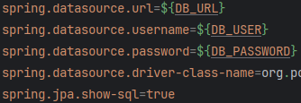

<a name="readme-top"></a>


<!-- PROJECT SHIELDS -->
<!--
*** I'm using markdown "reference style" links for readability.
*** Reference links are enclosed in brackets [ ] instead of parentheses ( ).
*** See the bottom of this document for the declaration of the reference variables
*** for contributors-url, forks-url, etc. This is an optional, concise syntax you may use.
*** https://www.markdownguide.org/basic-syntax/#reference-style-links
-->

<!-- PROJECT LOGO -->
<br />
<div align="center">
  <a href="https://github.com/GagoRobi/Project-E">
    
  </a>

<h3 align="center">Project-E</h3>

  <p align="center">
    Small business web application
    <br />
    <br />
    <a href="https://github.com/GagoRobi/Project-E/issues">Report Bug</a>
    ·
    <a href="https://github.com/GagoRobi/Project-E/issues">Request Feature</a>
  </p>
</div>


<!-- TABLE OF CONTENTS -->
<details>
  <summary>Table of Contents</summary>
  <ol>
    <li>
      <a href="#about-the-project">About The Project</a>
      <ul>
        <li><a href="#built-with">Built With</a></li>
      </ul>
    </li>
    <li>
      <a href="#getting-started">Getting Started</a>
      <ul>
        <li><a href="#prerequisites">Prerequisites</a></li>
        <li><a href="#installation">Installation</a></li>
      </ul>
    </li>
    <li><a href="#license">License</a></li>
    <li><a href="#contact">Contact</a></li>
</ol>
</details>


<!-- ABOUT THE PROJECT -->
## About The Project

> [!IMPORTANT]  
> <span style="color:orange">This project is still under development! </span><br/> 

This is a full-stack web-application for a small business that offers various events, from summer camps to one-on-one talk sessions.
The site's original language is Hungarian, but a translation is in the plans after the site is fully functional! <br/>
For now the app has a few tabs:
* A `Homepage` and a `Services` page with a placeholder "Lorem ipsum text", which will be customized for the client.
* An `Events` page where the available events are displayed, and can be applied to (connected to google Calendar).
* A `WebShop` page where various items can be ordered.
* `Cart` that revealed by clicking on the cart logo, <u>if it's NOT empty!</u>
* A`Login` and `Register` page. For now every registered user gets admin rights. This is only for the development phase. If all the functions are implemented, the `Registration` will probably be removed or it's implementations will change.
* An `Admin` page, that's only visible if a user with admin role is signed in.

### Future Plans involve:

* Customizing Home Page, and Services with valid descriptions.
* Creating visually appealing design.
* Web-shop's payment method implementation.
* Oauth 2.0 for login.
* Event Creator page's form validation.
* Revise deployment method.
* Implement missing Unit tests.

<p align="right">(<a href="#readme-top">back to top</a>)</p>

### Built With

* [![React][React.js]][React-url]
* [](https://www.javascript.com/)
* [](https://vitejs.dev/)
* [](https://en.wikipedia.org/wiki/CSS)
* [](https://hu.wikipedia.org/wiki/HTML5)
* [![Bootstrap][Bootstrap.com]][Bootstrap-url]
* [	](https://www.java.com/en/)
* [](https://spring.io/projects/spring-boot)
* [](https://www.postgresql.org/)
* [](https://www.docker.com/)
* [](https://github.com/GagoRobi)
* [](https://render.com/)

<p align="right">(<a href="#readme-top">back to top</a>)</p>


<!-- GETTING STARTED -->
## Getting Started

If you want to see the site working navigate to <a href="https://www.gago.hu/">https://www.gago.hu/</a>. You might have to wait about a minute, for the backend to start up. 
This is because the project is deployed trough <a href="https://render.com/">Render</a> with a free plan <i>for now</i>, which means `Render` stops the backend if there's no activity on the site. <br/>
Still if you have the spare 1-2 minutes, I advise this method of testing the site, because the HTTP request are tailored for Render and needs adjusting if the program is running locally. 

 If you see any event card loaded on the events page you can be sure, the backend is running.

You find the steps for running the project locally, in the next sections below!
### Prerequisites

First of all you'll need npm. You can check your version with the following command.
```sh 
npm -v
```
You can upgrade to the latest version of npm using:
  ```sh
  npm install npm@latest -g
  ```

You will also need:
* <a href="https://www.oracle.com/java/technologies/javase/jdk17-archive-downloads.html">JDK</a>
  or <a href="https://www.oracle.com/java/technologies/java-se-glance.html">JRE</a>,
* a <a href="https://www.postgresql.org/" >postgreSql</a> database,
*  and <a href="https://maven.apache.org/">Maven</a>.
* (optional) handling tool for PSQL databases (e.g: <a href="https://www.pgadmin.org/">pgAdmin</a>).

Change the `application.properties` file's fields, for your db details.</br> 
</br> and give value for the `JWT_SECRET` variable.

### Installation

Navigate to 
the project's frontend folder and install the dependencies from `package.json` file.
```sh
cd demo/src/main/ui/vite-project npm install
```
```sh
npm install
```

You will need to rewrite all the http requests url and the proxy in the vite.config file. 
For example in the `EventPage.jsx` from ```fetch("https://project-e-service.onrender.com/api/v1/events"...``` to ``` fetch("/api/v1/events"...```.
</br>
Also in the `vite.config` you'll need to set the proxy from ```'/api': 'https://project-e-service.onrender.com'```
to your localhost ```'/api': 'localhost:8080'```

If you followed these steps you should be able to use the site locally. Just run the java `MainApplication` from your IDE,
and use the `npm run dev` command from the `vite-project` folder.

<i>Still <a href="https://www.gago.hu/">https://www.gago.hu/</a> is faster way to try out the site.</i>

<p align="right">(<a href="#readme-top">back to top</a>)</p> 


[//]: # (<!-- USAGE EXAMPLES -->)

[//]: # (## Usage)

[//]: # ()
[//]: # (Use this space to show useful examples of how a project can be used. Additional screenshots, code examples and demos work well in this space. You may also link to more resources.)

[//]: # ()
[//]: # (_For more examples, please refer to the [Documentation]&#40;https://example.com&#41;_)

[//]: # ()
[//]: # (<p align="right">&#40;<a href="#readme-top">back to top</a>&#41;</p>)

[//]: # ()

[//]: # ()
[//]: # (<!-- ROADMAP -->)

[//]: # (## Roadmap)

[//]: # ()
[//]: # (- [ ] Feature 1)

[//]: # (- [ ] Feature 2)

[//]: # (- [ ] Feature 3)

[//]: # (    - [ ] Nested Feature)

[//]: # ()
[//]: # (See the [open issues]&#40;https://github.com/github_username/repo_name/issues&#41; for a full list of proposed features &#40;and known issues&#41;.)

[//]: # ()
[//]: # (<p align="right">&#40;<a href="#readme-top">back to top</a>&#41;</p>)

[//]: # ()

[//]: # ()
[//]: # (<!-- CONTRIBUTING -->)

[//]: # (## Contributing)

[//]: # ()
[//]: # (Contributions are what make the open source community such an amazing place to learn, inspire, and create. Any contributions you make are **greatly appreciated**.)

[//]: # ()
[//]: # (If you have a suggestion that would make this better, please fork the repo and create a pull request. You can also simply open an issue with the tag "enhancement".)

[//]: # (Don't forget to give the project a star! Thanks again!)

[//]: # ()
[//]: # (1. Fork the Project)

[//]: # (2. Create your Feature Branch &#40;`git checkout -b feature/AmazingFeature`&#41;)

[//]: # (3. Commit your Changes &#40;`git commit -m 'Add some AmazingFeature'`&#41;)

[//]: # (4. Push to the Branch &#40;`git push origin feature/AmazingFeature`&#41;)

[//]: # (5. Open a Pull Request)

[//]: # (<p align="right">&#40;<a href="#readme-top">back to top</a>&#41;</p>)


<!-- LICENSE -->
## License

Distributed under the MIT License. 

[//]: # (See `LICENSE.txt` for more information.)

<p align="right">(<a href="#readme-top">back to top</a>)</p>


<!-- CONTACT -->
## Contact

* Robert Gago - gagorobi96@gmail.com <br/>
* [![linkedin-shield]][linkedin-url] <br/>

Project Link: [https://github.com/GagoRobi/Project-E](https://github.com/GagoRobi/Project-E)
<p align="right">(<a href="#readme-top">back to top</a>)</p>

<!-- MARKDOWN LINKS & IMAGES -->
<!-- https://www.markdownguide.org/basic-syntax/#reference-style-links -->
[contributors-shield]: https://img.shields.io/github/contributors/github_username/repo_name.svg?style=for-the-badge
[contributors-url]: https://github.com/github_username/repo_name/graphs/contributors
[forks-shield]: https://img.shields.io/github/forks/github_username/repo_name.svg?style=for-the-badge
[forks-url]: https://github.com/github_username/repo_name/network/members
[stars-shield]: https://img.shields.io/github/stars/github_username/repo_name.svg?style=for-the-badge
[stars-url]: https://github.com/github_username/repo_name/stargazers
[issues-shield]: https://img.shields.io/github/issues/github_username/repo_name.svg?style=for-the-badge
[issues-url]: https://github.com/github_username/repo_name/issues
[license-shield]: https://img.shields.io/github/license/github_username/repo_name.svg?style=for-the-badge
[license-url]: https://github.com/github_username/repo_name/blob/master/LICENSE.txt
[linkedin-shield]: https://img.shields.io/badge/-LinkedIn-black.svg?style=for-the-badge&logo=linkedin&colorB=555
[linkedin-url]: https://www.linkedin.com/in/robert-gago-cc/
[product-screenshot]: images/screenshot.png
[Next.js]: https://img.shields.io/badge/next.js-000000?style=for-the-badge&logo=nextdotjs&logoColor=white
[Next-url]: https://nextjs.org/
[React.js]: https://img.shields.io/badge/React-20232A?style=for-the-badge&logo=react&logoColor=61DAFB
[React-url]: https://reactjs.org/
[Vue.js]: https://img.shields.io/badge/Vue.js-35495E?style=for-the-badge&logo=vuedotjs&logoColor=4FC08D
[Vue-url]: https://vuejs.org/
[Angular.io]: https://img.shields.io/badge/Angular-DD0031?style=for-the-badge&logo=angular&logoColor=white
[Angular-url]: https://angular.io/
[Svelte.dev]: https://img.shields.io/badge/Svelte-4A4A55?style=for-the-badge&logo=svelte&logoColor=FF3E00
[Svelte-url]: https://svelte.dev/
[Laravel.com]: https://img.shields.io/badge/Laravel-FF2D20?style=for-the-badge&logo=laravel&logoColor=white
[Laravel-url]: https://laravel.com
[Bootstrap.com]: https://img.shields.io/badge/Bootstrap-563D7C?style=for-the-badge&logo=bootstrap&logoColor=white
[Bootstrap-url]: https://getbootstrap.com
[JQuery.com]: https://img.shields.io/badge/jQuery-0769AD?style=for-the-badge&logo=jquery&logoColor=white
[JQuery-url]: https://jquery.com 
